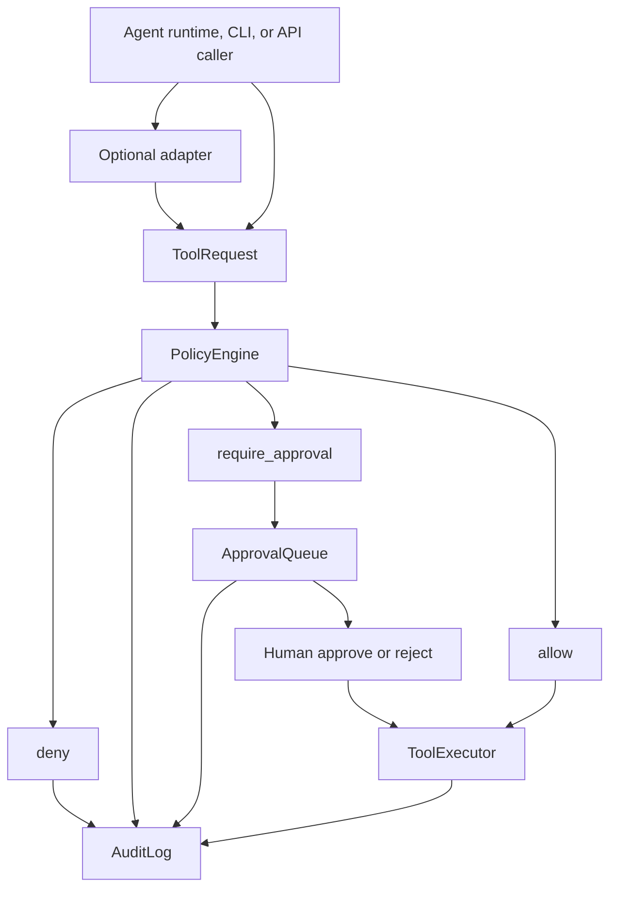

# Architecture Diagram

Last updated: 2026-05-07

AgentGate is the control layer between a proposed tool call and the side effect
that would happen if the tool ran.

## Request Lifecycle

1. A caller or adapter submits a structured `ToolRequest`.
2. `PolicyEngine` returns `allow`, `deny`, or `require_approval`.
3. Allowed requests can execute through the local executor.
4. Approval-required requests are stored in SQLite and tied to the exact
   request payload.
5. A human can approve or reject the stored request.
6. Approved execution uses the stored request and records a JSONL audit event.

## Current Scope

- File read/write-style requests are supported for the local demo.
- Shell execution is denied by policy and not implemented by the executor.
- Delete execution is denied by policy and not implemented by the executor.
- Optional adapters convert plain dictionaries into `ToolRequest`; no provider
  SDK is required by the core package.

